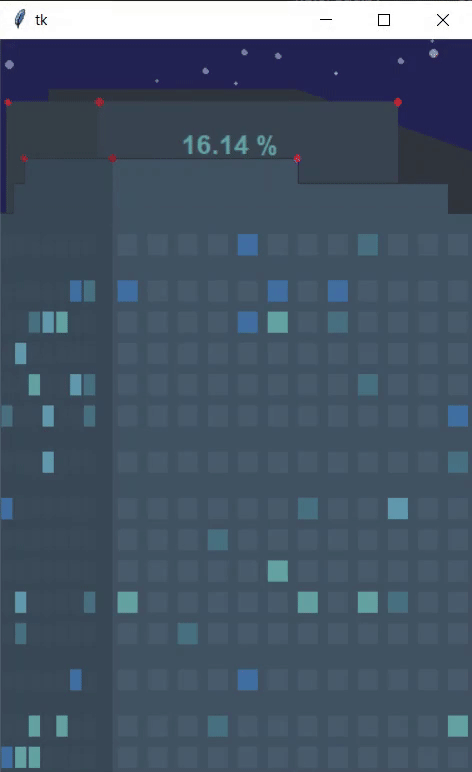

# Building Progress Bar

Loads tkinter window with frames and canvas representing a building with windows without lights on. Instead of bar, programm uses building's windows to represent status. The more windows with lights turned on the closer it is to 100% status.

## GUI Example

