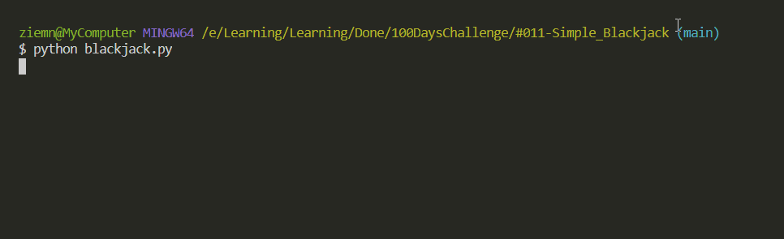

# Simple Blackjack

Very simple blackjack script built without classes, money tracking, deck etc.
No split and insurance options.

## Level:
    Beginner

## Built with
* Python
    - Libraries
        - [random](https://docs.python.org/3/library/random.html)
        - [time](https://docs.python.org/3/library/time.html)

### Visualisation

