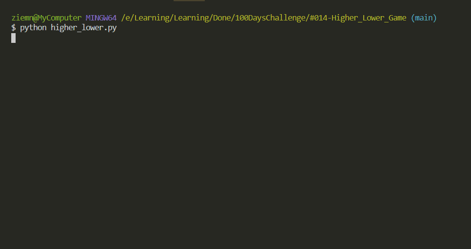

# Higher Lower

Guess which option has higher value (followers)
Small script for popular Higher Lower game.

## Level:
    Beginner

## Built with
* Python
    - Libraries
        - [random](https://docs.python.org/3/library/random.html)
        - [os](https://docs.python.org/3/library/os.html)
        - [time](https://docs.python.org/3/library/time.html)

### Visualisation

