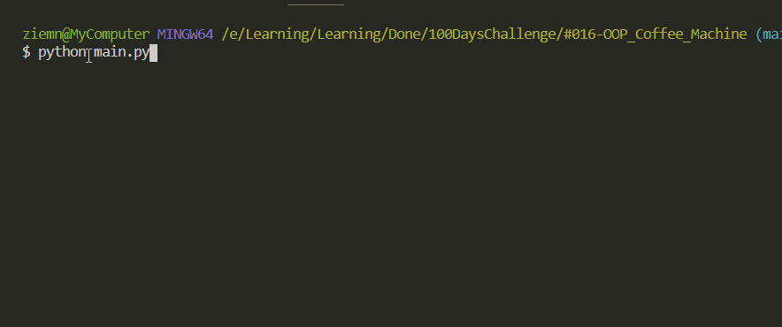

# OOP Coffee Machine

Simulating coffee machine system.
Storing recipies, stock and money information.
Same like #015 challenge but using OOP.

## Level:
    Intermediate

## Built with
* Python

### Visualisation

