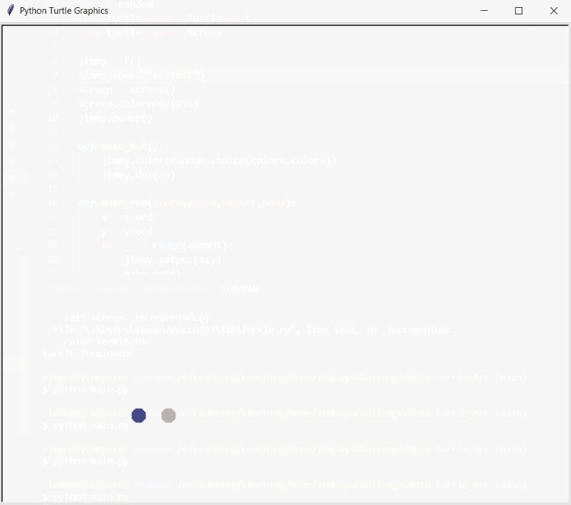

# Quiz Game

Create some kind of dot art using Turtle module.

## Level:
    Intermediate

## Built with
* Python
    - Modules:
        - [Turtle](https://docs.python.org/3/library/turtle.html#module-turtle)
        - [Random](https://docs.python.org/3/library/random.html)
        - [Colorgram](https://pypi.org/project/colorgram.py/)

### Visualisation

