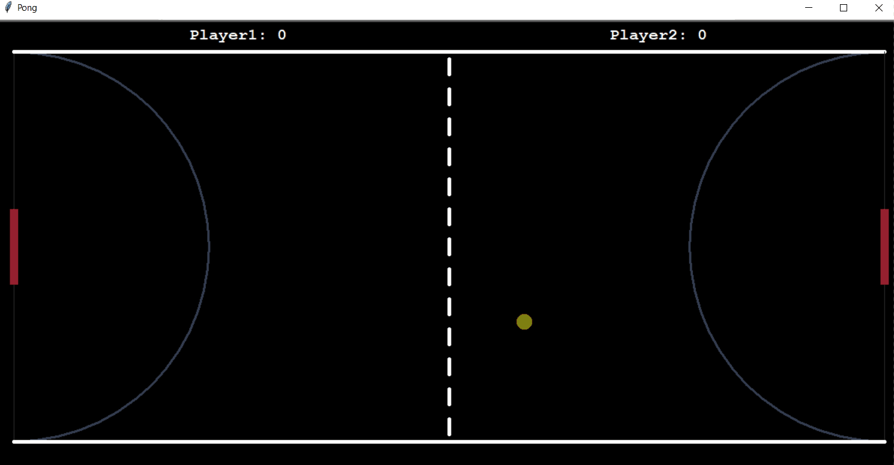

# PONG

Popular PONG game.  
GIF is with 12frames/sec.  

## Rules:

* Player 1 movement: 
    - "W" - Up
    - "S" - Down

* Player 2 movement:
    - "⬆️" - Up
    - "⬇️" - Down

Game is played until one of the players scores 3 points.
Ball gets faster every 5 bounces. Ball's speed restart on scored point.

## Level:
    Intermediate

## Built with
* Python
    - Modules:
        - [Turtle](https://docs.python.org/3/library/turtle.html#module-turtle)
        - [Random](https://docs.python.org/3/library/random.html)
        - [Time](https://docs.python.org/3/library/time.html)

### Visualisation

