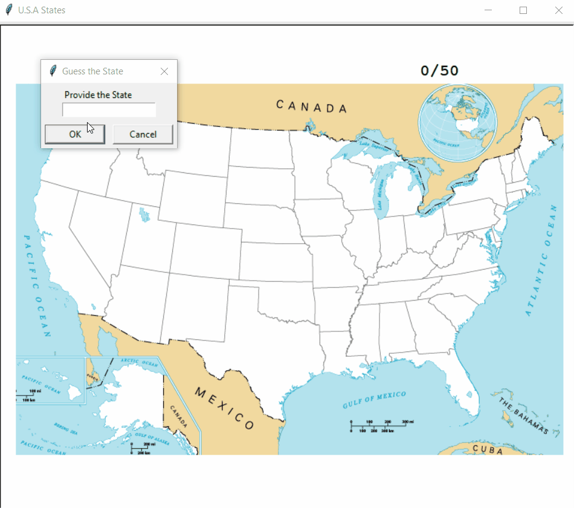

# USA States Game

Can you guess 50 states of USA?

## How it works:

For each correct guess +1 point.
Insentive to big/small letters.
If answer repeated Game Over.
Wrong answer Game Over.
Exit - Makes programm stop.
Will generate csv file for not guessed states.  
## Level:
    Intermediate

## Built with
* Python
    - Module
        - [Pandas](https://pandas.pydata.org/docs/)
        - [Turtle](https://docs.python.org/3/library/turtle.html)

### Visualisation

