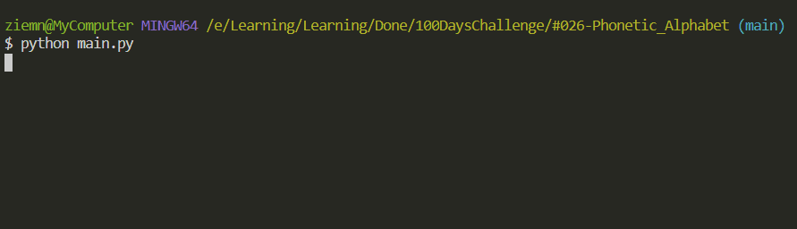

# NATO/IATA phonetic alphabet 

Generates phonetic alphabet by provided input from user.

## Details:

Challenge was to practice Python List Comprehensions.
## Level:
    Intermediate

## Built with
* Python
    - Module
        - [Pandas](https://pandas.pydata.org/docs/)
        - [List Comprehensions](https://docs.python.org/3/tutorial/datastructures.html#list-comprehensions)

### Visualisation

