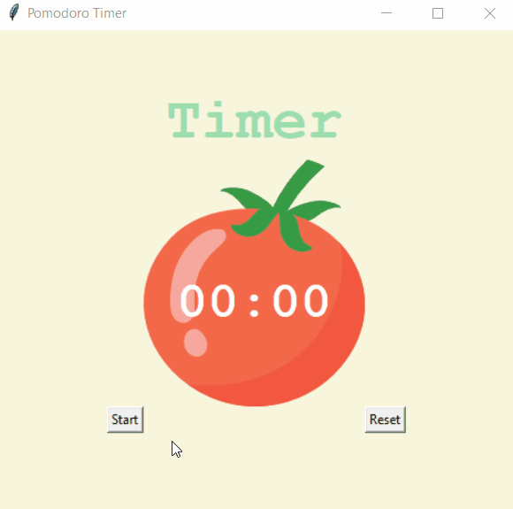

# Pomodoro Timer

Program to help you maintain good working routine.

## Details:

It's a timer that for every 25 minutes it will count 5 minutes of break.
For 4 cycles - longer break awarded with 20 minutes.

## Level:
    Intermediate

## Built with
* Python
    - Module
        - [tkinter](https://docs.python.org/3/library/tkinter.html)
        - [math](https://docs.python.org/3/library/math.html)

### Visualisation

