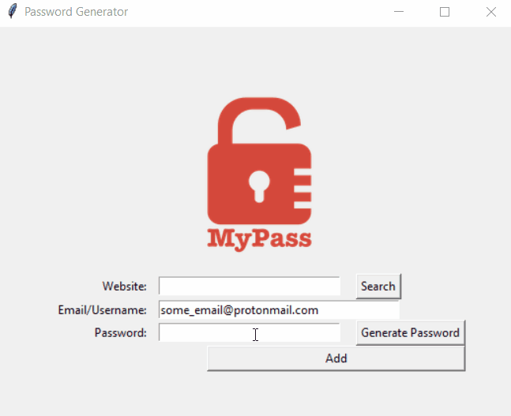

# Password Manager

Program to generate, store and retrieve your passwords.

## Details:

Program stores all passwords in JSON file.
Password can be generated.
Password can be retrieved by providing correct "Website" (dictionary key)

## Level:
    Intermediate

## Built with
* Python
    - Module
        - [tkinter](https://docs.python.org/3/library/tkinter.html)
        - [random](https://docs.python.org/3/library/random.html)
        - [pyperclip](https://pypi.org/project/pyperclip/)
        - [json](https://docs.python.org/3/library/json.html)

### Visualisation

