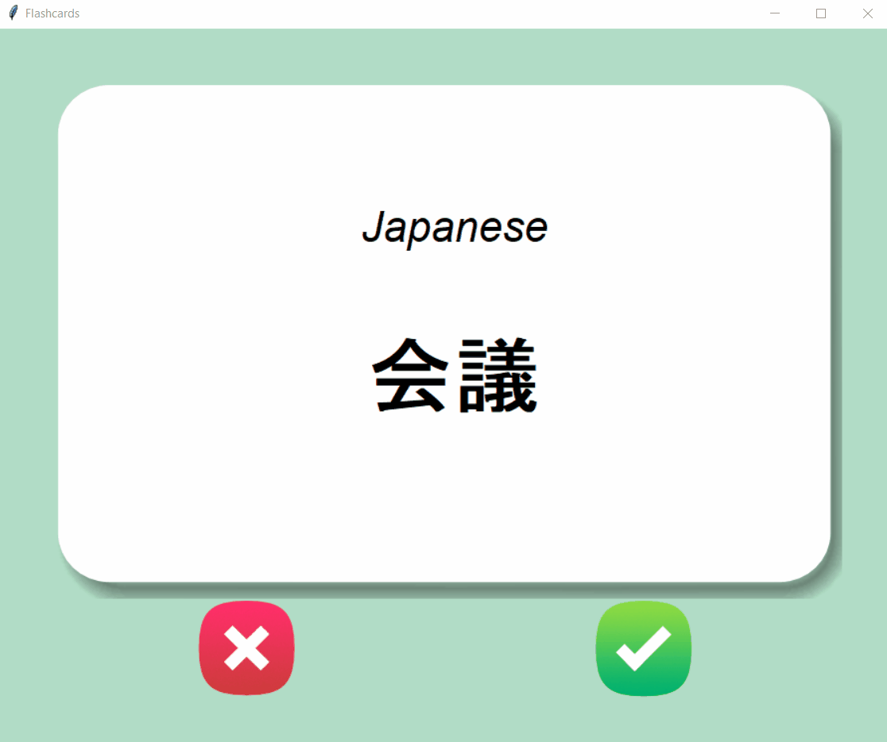

# Flashcards

Japanese->English flashcards.

## Details:

Flashcards holds almost 1000 words taken from the most popular words used in a movie.
Data was taken from https://github.com/hermitdave/FrequencyWords/tree/master/content/2018
and translated with machine translator.
Words are stored in json file and each of them will be removed from the file after pressing tick button.
Flashcard will flip to translation after 3 seconds

## Level:
    Intermediate

## Built with
* Python
    - Module
        - [Pandas](https://pandas.pydata.org/docs/)
        - [google_trans_new](https://pypi.org/project/google-trans-new/)
        - [tkinter](https://docs.python.org/3/library/tkinter.html)
        - [random](https://docs.python.org/3/library/random.html)
        - [json](https://docs.python.org/3/library/json.html)

### Visualisation

