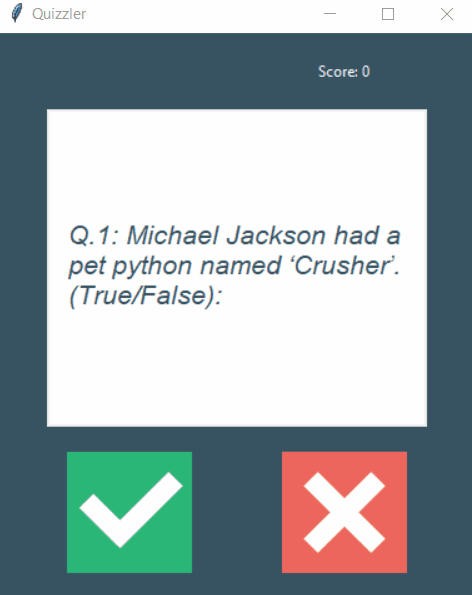

# GUI Quiz App

Gives user 10 True/False questions to answer.

## Details:

Questions are downloaded via [Opentdb Api](https://opentdb.com/api_config.php). 
After 10 questions being answered program will be locked.
App stores score of an user.

## Level:
    Intermediate

## Built with
* Python
    - Module
        - [requests](https://pypi.org/project/requests/)
        - [html](https://docs.python.org/pl/3/library/html.html)
        - [tkinter](https://docs.python.org/3/library/tkinter.html)

### Visualisation

