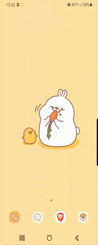

# Weather Forecast SMS

Sends sms to an user if within next 12 hours it is going to rain.

## Details:

Using OpenWeatherMap API gets hourly weather data for a location and filtrs 
it to nearest 12 hours. If within 12 hours it is going to rain, program 
will connect to TWILIO Client and will notify a user to bring an umbrella via 
SMS message.

## Level:
    Intermediate+

## Built with
* Python
    - Module
        - [requests](https://pypi.org/project/requests/)
        - [os](https://docs.python.org/3/library/os.html)
        - [dotenv](https://pypi.org/project/python-dotenv/)
        - [twilio-rest](https://www.twilio.com/docs/usage/api)
* API
    - [Twilio](https://www.twilio.com/docs/api)
    - [OpenWeather](https://openweathermap.org/api)

### Visualisation

