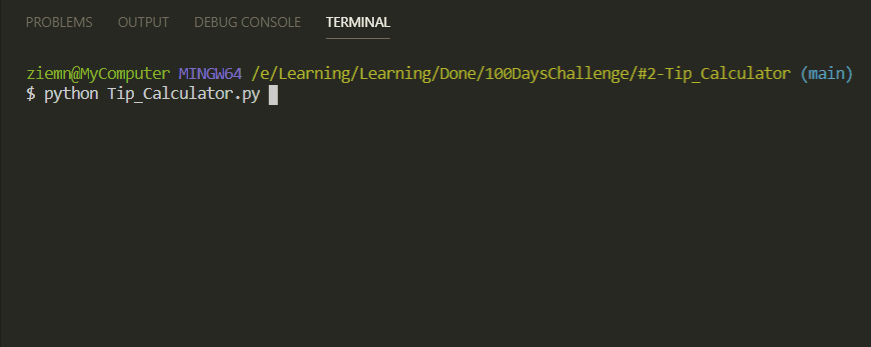

# Tip_Calculator

Calculating what amount of tip should each person pay based on:

- Bill amout
- Percentage to tip
- Number of people

## Level:
    Beginner

## Built with
* Python
    - Built-in Functions:
        - [print](https://docs.python.org/3/library/functions.html#print)
        - [input](https://docs.python.org/3/library/functions.html#input)
        - [int](https://docs.python.org/3/library/functions.html#int)
        - [float](https://docs.python.org/3/library/functions.html#float)
        - [f-string](https://docs.python.org/3/reference/lexical_analysis.html#f-strings)

### Visualisation

