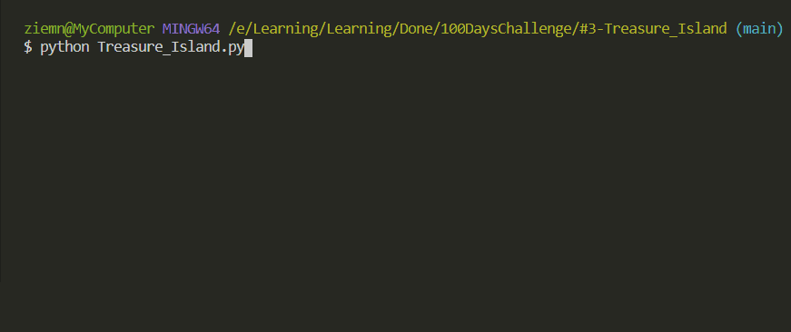

# Treasure_Island

Short "choose your adventure" game using control flows.

## Level:
    Beginner

## Built with
* Python
    - Built-in Functions:
        - [lower](https://docs.python.org/3/library/stdtypes.html#str.lower)
        - [if-statements](https://docs.python.org/3/tutorial/controlflow.html#if-statements)

### Visualisation

