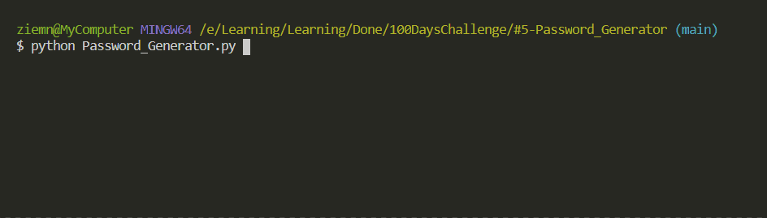

# Password Generator

Generating random password based by user input:

- Number of letters
- Number of symbols
- Number of numbers

## Level:
    Beginner

## Built with
* Python
    - Built-in Functions:
        - [random](https://docs.python.org/3/library/random.html)
        - [for-statements](https://docs.python.org/3/tutorial/controlflow.html#for-statements)
        - [lists](https://docs.python.org/3/tutorial/datastructures.html#more-on-lists)
        
### Visualisation

