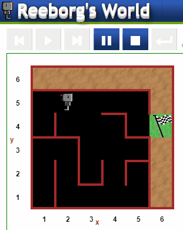

# Escape the Maze

Using [Reeborg's World](https://reeborg.ca/reeborg.html?lang=en&mode=python&menu=worlds%2Fmenus%2Freeborg_intro_en.json&name=Maze&url=worlds%2Ftutorial_en%2Fmaze1.json) platform, make Reeborg escape randomly generated maze.

## Level:
    Beginner

## Built with
* Python
    - General:
        - [functions](https://docs.python.org/2.0/ref/function.html)
        - [while-loop](https://docs.python.org/3/reference/compound_stmts.html#while)
* [Reeborg's World](https://reeborg.ca/index_en.html)

### Visualisation

