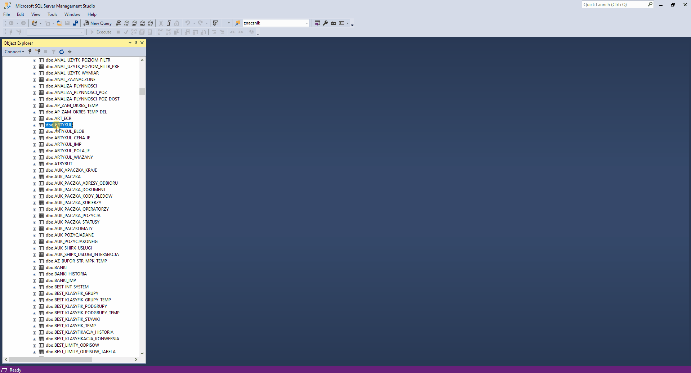

# dbdiagram.io Converter

Converts SQL-Server's script Create Table to dbdiagram.io styled code.

## Details:

Database I have to get to known is huge so I am trying to document it 
for future needs. dbdiagram.io platform is visually appealing but it misses 
some crucial points like expand table or sort by keys etc. If a table has 
over 100 columns it's unreadable so I decided to sort it somehow. 
Because I am lazy I made a script that will make basic layout so I don't 
have to retype it or use basic dbdiagram.io converter. On this layout I can 
futher process the documentation. 

## Built with
* Python
    - Module
        - [tkinter](https://docs.python.org/3/library/tkinter.html)
        - [pyperclip](https://pypi.org/project/pyperclip/)
        - [json](https://docs.python.org/3/library/json.html)
* SQL-Server
* JSON

### Visualisation

